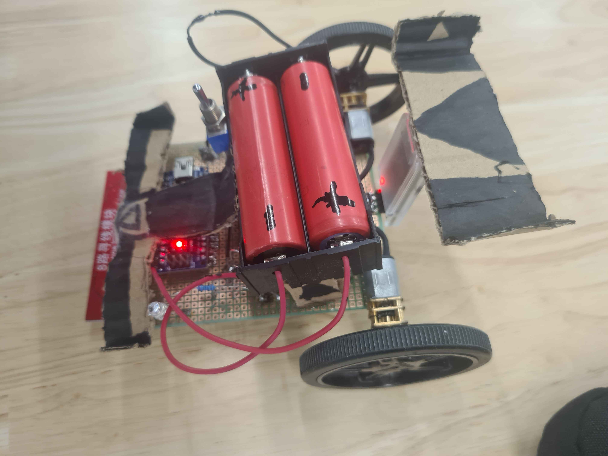

# LineFollower

lege repository die je als template kan gebruiken om een eigen repository te starten voor uw linefollower project

  
## specifications

microcontroller: Arduino Nano R3 - kloon - met headers

motors: 2 keer => Aslong JGA12-N20-30 DC-Transmissiemotor 6V - 500RPM

h-bridge: TB6612FNG Easy Motor Driver

sensors: 8x IR Lijn Tracking Module - 40mm Bereik QTR-8A

batteries: 2 keer => 3.7V 18650 2600mAh

wireless communication: dsd tech hm-10

distance sensor - motors: 9cm

weight: 218g

speed: 0.6m/s

